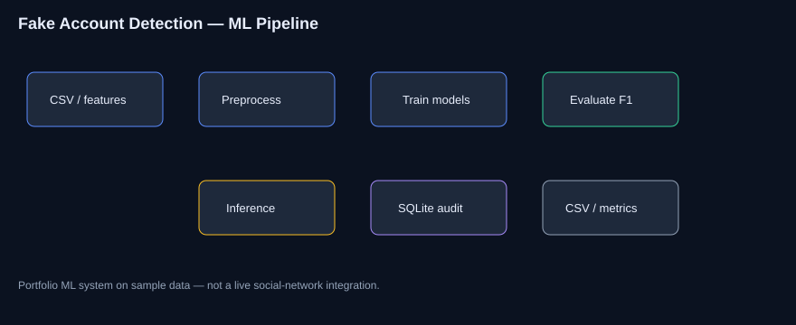

<div align="center">

# Detection of Fake Accounts on Social Media

### B.Tech Project · Machine Learning · Classification · ETL Practice

[](https://www.python.org/)
[](https://scikit-learn.org/)
[](Dockerfile)
[](LICENSE)

**Amaragani Nikhil Sai** · B.Tech CSE · SIIET (JNTUH)  
Runnable ML pipeline on sample data. Not a live social-network integration.

</div>

---

## Problem

Fake profiles can spread spam and misinformation. Manual review does not scale well. This project implements a **complete supervised learning pipeline**: prepare features, train and compare models, evaluate metrics, and log predictions.

---

## Solution

An end-to-end ML pipeline with:

- Feature engineering (Pandas / NumPy)  
- Multi-model training (RF, LogReg, Gradient Boosting)  
- F1-aware selection, confusion matrices, feature importance  
- Hyperparameter search (GridSearchCV)  
- ETL-style batch scoring + SQLite audit log  
- SQL analytics scripts + EDA report  

---

## Features

- End-to-end train → evaluate → infer  
- Metrics export for review  
- Batch ETL load  
- SQL queries for cohort analysis  
- Dockerized pipeline  
- pytest for preprocessing  

---

## Architecture



---

## Tech stack

Python · Pandas · NumPy · scikit-learn · SQL (SQLite) · Docker · pytest

---

## Folder structure

```text
src/  tests/  docs/  data/  models/  notebooks/  scripts/  images/
Dockerfile  docker-compose.yml  requirements.txt  .github/workflows/ci.yml
```

---

## Installation

```bash
git clone https://github.com/nikhilamaragani-jpg/detection-of-fake-accounts-on-social-media.git
cd detection-of-fake-accounts-on-social-media
pip install -r requirements.txt
```

---

## Usage

```bash
python src/main.py
python src/tune_hyperparams.py
python src/etl_batch.py
python scripts/eda_report.py
pytest -q
docker compose up --build
```

---

## Project workflow

1. Load sample CSV  
2. Engineer features / split  
3. Train & compare models  
4. Export metrics  
5. Score batches → SQLite + CSV  
6. Analyze with SQL / EDA notes  

---

## Screenshots / results

| Asset | Path |
|-------|------|
| Architecture | [images/architecture.svg](images/architecture.svg) |
| Sample metrics | [data/outputs/metrics.sample.json](data/outputs/metrics.sample.json) |
| EDA output | `data/outputs/eda_report.md` (after script) |

---

## Results

Metrics on the small included dataset are illustrative — re-run locally for current numbers. **Prototype honesty:** sample/synthetic-style data, not live platform APIs.

---

## Future improvements

- [ ] Larger public datasets + imbalance techniques  
- [ ] Stronger evaluation notebooks  
- [ ] Incremental batch scoring design notes  

---

## Skills demonstrated

Machine Learning · feature engineering · evaluation · hyperparameter tuning · ETL practice · SQL analytics · Docker · documentation

---

## Documentation

[PROJECT_BRIEF](docs/PROJECT_BRIEF.md) · [DEMO](docs/DEMO.md) · [INTERVIEW](docs/INTERVIEW.md) · [RESUME_BULLETS](docs/RESUME_BULLETS.md) · [DATA_ANALYST](docs/DATA_ANALYST.md) · [ML_NOTES](docs/ML_NOTES.md)

## License

MIT

**Author:** Amaragani Nikhil Sai · B.Tech CSE · https://nikhilamaragani-jpg.github.io/
