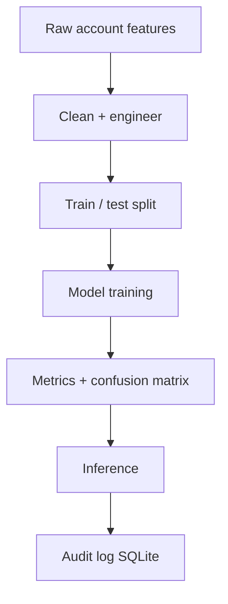

<div align="center">

# Fake Account Detection on Social Media

### Machine Learning · Data Analysis · Trust & Safety Pipeline

[](https://www.python.org/)
[](https://scikit-learn.org/)
[](Dockerfile)
[](LICENSE)

**Portfolio ML system** by [Amaragani Nikhil Sai](https://github.com/nikhilamaragani-jpg)  
Runnable training + evaluation pipeline on sample data. Not a live social network integration.

</div>

---

## Problem

Fake social profiles spread spam and erode trust. Manual review does not scale. Teams need a **repeatable classification pipeline**: features, train/test split, multi-model comparison, metrics beyond accuracy, and audit logs.

---

## Solution

An end-to-end **supervised ML pipeline** for account risk scoring:

- Load / generate profile-activity features (Pandas)  
- Feature engineering + train/test split  
- Train Random Forest, Logistic Regression, Gradient Boosting  
- Evaluate with **accuracy, F1, classification report**  
- Optional confusion matrix + feature importance export  
- Sample inference + SQLite prediction log  
- ETL-style script for batch scoring  

---

## Features

- Multi-model comparison with F1-aware selection  
- Sample CSV dataset + synthetic fallback  
- Metrics artifacts under `models/` / `data/outputs/`  
- Prediction audit trail (SQLite)  
- Dockerized batch run  
- pytest coverage for preprocessing  
- Docs for Data Analyst + ML interview angles  

---

## Architecture

```text
CSV / synthetic data
        |
        v
Preprocess & features  -->  train/test split
        |
        v
Train models (RF · LogReg · GradientBoosting)
        |
        v
Evaluate (accuracy, F1, report, confusion matrix)
        |
        v
Select best by F1 --> predict sample --> SQLite log
```



---

## Tech stack

| Area | Technology |
|------|------------|
| Language | Python 3 |
| Data | Pandas, NumPy |
| ML | scikit-learn |
| Storage | SQLite |
| Packaging | Docker |
| Quality | pytest |
| Analytics angle | EDA notes, Power BI export guidance |

---

## Folder structure

```text
.
├── README.md
├── LICENSE
├── requirements.txt
├── Dockerfile
├── docker-compose.yml
├── .env.example
├── .github/workflows/ci.yml
├── src/
│   ├── main.py
│   ├── preprocess.py
│   ├── model.py
│   ├── metrics_export.py
│   ├── etl_batch.py
│   └── database.py
├── tests/
├── docs/
├── data/
├── models/
├── notebooks/
├── scripts/
└── images/
```

---

## Installation

```bash
git clone https://github.com/nikhilamaragani-jpg/detection-of-fake-accounts-on-social-media.git
cd detection-of-fake-accounts-on-social-media
pip install -r requirements.txt
```

---

## Usage

```bash
# Full train → evaluate → sample predict
python src/main.py

# Batch ETL-style scoring
python src/etl_batch.py

# Tests
pytest -q

# Docker
docker compose up --build
```

---

## Project workflow

1. Ingest sample CSV (or generate synthetic labeled data)  
2. Engineer ratios and profile completeness features  
3. Train three classifiers  
4. Compare metrics; pick best by F1  
5. Export metrics artifacts  
6. Score a suspicious sample profile and log it  

---

## Screenshots / results assets

| Asset | Location |
|-------|----------|
| Metrics JSON | `data/outputs/metrics.json` (after run) |
| Confusion matrix CSV | `data/outputs/confusion_matrix.csv` |
| Feature importance | `data/outputs/feature_importance.csv` |
| Diagram notes | `images/README.md` |

---

## Results

| Item | Status |
|------|--------|
| End-to-end train/eval/predict | Implemented |
| Multi-model comparison | Implemented |
| F1-aware selection | Implemented |
| Metrics export | Implemented |
| Live social API ingestion | Not implemented (roadmap) |
| Production model registry | Not implemented (roadmap) |

---

## Future improvements

- [ ] Hyperparameter search (GridSearchCV / Optuna)  
- [ ] Larger public datasets + class imbalance techniques  
- [ ] Graph / network features  
- [ ] Model card + drift monitoring sketch  
- [ ] Power BI dashboard from exported metrics  

---

## Skills demonstrated

ML fundamentals · feature engineering · evaluation literacy · Pandas EDA · ETL-style batch scoring · modular Python · Docker · documentation for hiring reviews

---

## Documentation

- [docs/PROJECT_BRIEF.md](docs/PROJECT_BRIEF.md)  
- [docs/DEMO.md](docs/DEMO.md)  
- [docs/INTERVIEW.md](docs/INTERVIEW.md)  
- [docs/RESUME_BULLETS.md](docs/RESUME_BULLETS.md)  
- [docs/DATA_ANALYST.md](docs/DATA_ANALYST.md)  
- [docs/DATA_ENGINEERING.md](docs/DATA_ENGINEERING.md)  
- [docs/ML_NOTES.md](docs/ML_NOTES.md)  
- [docs/ABOUT_TOPICS.md](docs/ABOUT_TOPICS.md)  

---

## License

MIT — see [LICENSE](LICENSE).

**Author:** Amaragani Nikhil Sai · https://nikhilamaragani-jpg.github.io/
