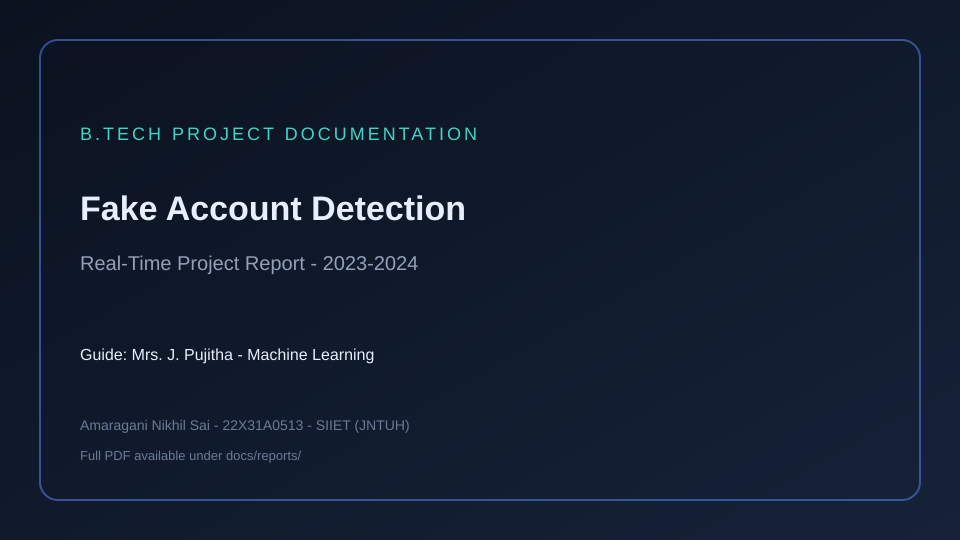
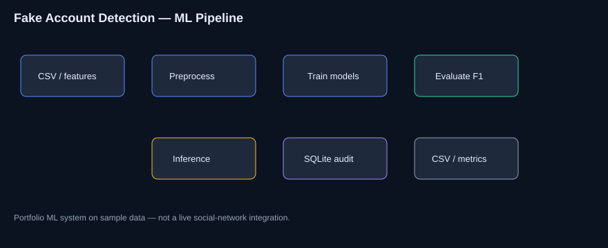

<div align="center">

# Detection of Fake Accounts on Social Media

### B.Tech Real-Time Project (2023–2024) · Machine Learning · Classification

[](https://www.python.org/)
[](https://scikit-learn.org/)
[](Dockerfile)
[](LICENSE)

**Amaragani Nikhil Sai** · Roll **22X31A0513** · SIIET (JNTUH)  
**Guide:** Mrs. J. Pujitha · Academic year **2023–2024**

Runnable ML pipeline on sample data. Not a live social-network integration.  
Report notes: [docs/REPORT_SUMMARY.md](docs/REPORT_SUMMARY.md)

</div>

---



> **Dataset caveat:** The repository includes only 30 illustrative, balanced rows.
> Data provenance and ground-truth labeling are not documented, so generated
> evaluation metrics are a workflow demo—not evidence of real-world accuracy.
> See [data/README.md](data/README.md).

## Problem

Fake profiles can spread spam and misinformation. Manual review does not scale. This project implements a **supervised learning pipeline** from profile/activity features to classification and audit logs.

---

## Solution

- Feature preparation (Pandas / NumPy)  
- Train Random Forest, Logistic Regression, Gradient Boosting  
- Select models with training-only stratified cross-validation; report precision, recall, F1, balanced accuracy, ROC AUC, and confusion matrices on a held-out split
- Export metrics artifacts  
- Sample inference + SQLite prediction log  
- Optional ETL-style batch scoring  

---

## Architecture



```text
Sample account CSV → Validate & engineer features → Stratified holdout split
  → Training-fold model selection → Holdout evaluation → Predict + audit log
```

---

## Tech stack

Python · Pandas · NumPy · scikit-learn · SQLite · Docker · pytest

---

## Installation & usage

```bash
git clone https://github.com/nikhilamaragani-jpg/detection-of-fake-accounts-on-social-media.git
cd detection-of-fake-accounts-on-social-media
pip install -r requirements.txt
python src/main.py
python src/etl_batch.py   # optional batch scoring
pytest -q
```

---

## Documentation

[DATASET](data/README.md) · [REPORT_SUMMARY](docs/REPORT_SUMMARY.md) · [PROJECT_BRIEF](docs/PROJECT_BRIEF.md) · [DATA_ANALYST](docs/DATA_ANALYST.md) · [DEMO](docs/DEMO.md) · [INTERVIEW](docs/INTERVIEW.md) · [RESUME_BULLETS](docs/RESUME_BULLETS.md) · [ML_NOTES](docs/ML_NOTES.md)

## License

MIT · **Author:** Amaragani Nikhil Sai · https://nikhilamaragani-jpg.github.io/

### Academic report PDF

- **Real-time project PDF:** [docs/reports/Real_Time_Project_Fake_Account_Detection_Report.pdf](docs/reports/Real_Time_Project_Fake_Account_Detection_Report.pdf)
