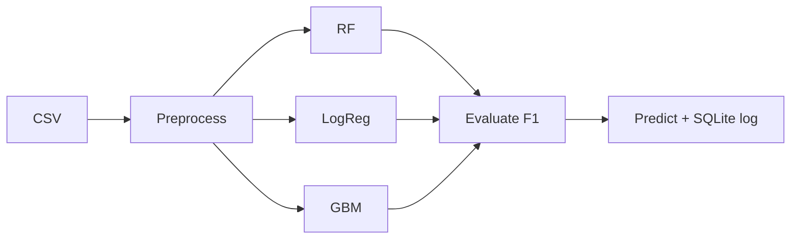

# Demo walkthrough

```bash
pip install -r requirements.txt
python src/main.py
```

```text
Fake Account Detection  |  B.Tech ML Prototype
Dataset size: N
--- Model Evaluation ---
RandomForest / LogisticRegression / GradientBoosting
  Accuracy · F1
Best model by F1: ...
--- Sample Prediction ---
Predicted Label: Fake / Genuine
```


