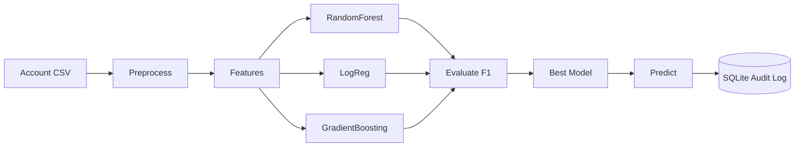

# Demo Walkthrough — Fake Account Detection

## Expected output shape

```text
============================================================
  Fake Account Detection  |  B.Tech ML Prototype
  Preprocess · Train · Compare · Predict · Audit log
============================================================
Dataset size: N records
Features used: account_age_days, followers, ...

--- Model Evaluation ---
RandomForest
  Accuracy: 0.xxx
  F1-score: 0.xxx
...
GradientBoosting
  Accuracy: 0.xxx
  F1-score: 0.xxx
Best model by F1: ...

--- Sample Prediction (suspicious profile pattern) ---
Predicted Label: Fake (p_fake=0.xx)
Prediction saved to SQLite (data/predictions.db)
```

## Architecture


